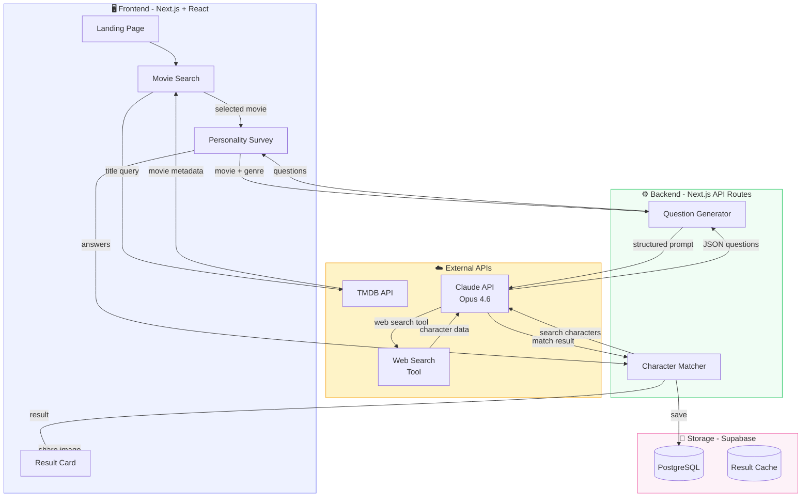
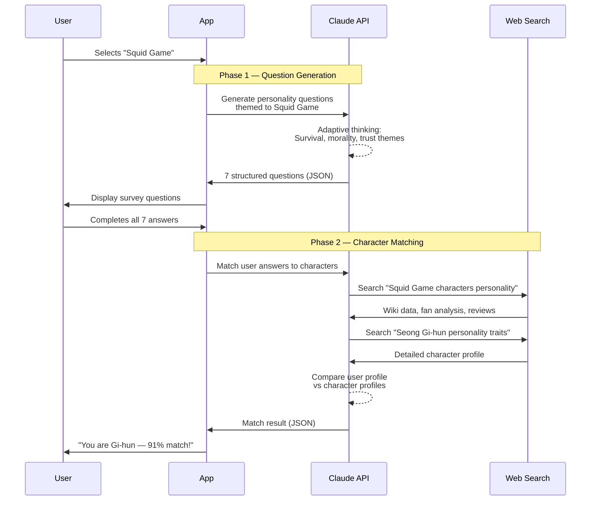
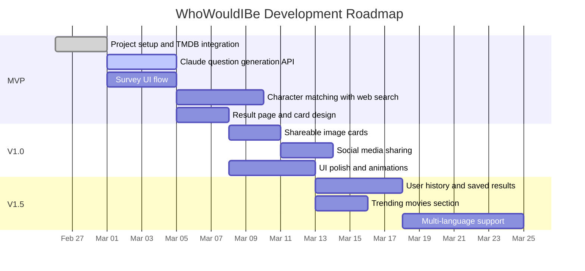

<p align="center">
  
</p>

<h1 align="center">WhoWouldIBe</h1>

<p align="center">
  <strong>Discover which movie or drama character matches your personality</strong>
</p>

<p align="center">
  <a href="#features">Features</a> &bull;
  <a href="#demo">Demo</a> &bull;
  <a href="#architecture">Architecture</a> &bull;
  <a href="#getting-started">Getting Started</a> &bull;
  <a href="#tech-stack">Tech Stack</a> &bull;
  <a href="#roadmap">Roadmap</a>
</p>

<p align="center">
  
  
  
  
  
</p>

---

## What is WhoWouldIBe?

**WhoWouldIBe** is an AI-powered web app where you enter any movie or drama, take a short personality survey, and an AI agent researches the characters in real-time to find your perfect match.

Unlike generic personality quizzes, WhoWouldIBe dynamically generates questions tailored to the themes and world of your chosen story, then uses Claude's web search capabilities to build rich character profiles before matching you.

```
┌─────────────────────────────────────────────────────────────────┐
│                                                                 │
│   🎬  Enter "Parasite"                                          │
│       ↓                                                         │
│   📋  Take 7 themed questions about ambition, morality, family  │
│       ↓                                                         │
│   🤖  AI searches character wikis & builds personality profiles │
│       ↓                                                         │
│   🎯  "You are Ki-woo — 87% match!"                            │
│       Strategic, ambitious, hopeful...                          │
│       ↓                                                         │
│   📤  Share your result card on social media                    │
│                                                                 │
└─────────────────────────────────────────────────────────────────┘
```

---

## Features

### 🔍 Smart Movie Search
Auto-complete search powered by TMDB API with poster thumbnails, release year, and genre tags to confirm the right title.

### 📋 AI-Generated Personality Survey
7-10 questions dynamically created by Claude, themed to the selected movie/drama. A thriller gets moral dilemma questions; a romance gets relationship-style questions.

### 🤖 Real-Time Character Research
Claude uses web search tools to crawl character wikis, fan sites, and reviews — building detailed personality profiles for every major character.

### 🎯 Personality Matching & Reasoning
Your survey responses are analyzed against each character's profile. You get a match percentage, shared traits visualization, and a detailed reasoning paragraph explaining *why* you match.

### 📤 Shareable Result Cards
Beautiful result cards rendered as images, ready to share on Twitter/X, Instagram Stories, or KakaoTalk.

---

## Demo

### User Flow Preview

```
 ╔══════════════════╗     ╔══════════════════╗     ╔══════════════════╗
 ║   🏠 Landing     ║     ║   📋 Survey      ║     ║   🎯 Result      ║
 ║                  ║     ║                  ║     ║                  ║
 ║  Search bar      ║────▶║  Q1 of 7         ║────▶║  Ki-woo (87%)    ║
 ║  Popular picks   ║     ║  [A] [B] [C] [D] ║     ║  ████████░░ 87%  ║
 ║  "Try Parasite"  ║     ║  Progress ██░░░  ║     ║  Traits + Why    ║
 ║                  ║     ║                  ║     ║  [Share] [Retry] ║
 ╚══════════════════╝     ╚══════════════════╝     ╚══════════════════╝
```

> **Try the interactive demo**: Open `WhoWouldIBe_Demo.jsx` in any React environment, or open `demo.html` directly in your browser for a standalone preview.

---

## Architecture

### System Overview



### AI Pipeline (Two-Phase)



### Data Flow


---

## Tech Stack

| Layer | Technology | Purpose |
|-------|-----------|---------|
| **Frontend** | React 19 + Next.js 15 | SSR, routing, UI framework |
| **Styling** | Tailwind CSS 4 | Clean and minimal design system |
| **AI Engine** | Claude API (Opus 4.6) | Question generation + character matching |
| **AI Tools** | Claude Tool Use (Web Search) | Real-time character research |
| **Movie Data** | TMDB API | Title search, posters, cast, metadata |
| **Database** | Supabase (PostgreSQL) | Results storage, analytics |
| **Image Gen** | html2canvas | Shareable result card images |
| **Hosting** | Vercel | Edge deployment, serverless functions |
| **Language** | TypeScript 5 | Type safety across the stack |

---

## Getting Started

### Prerequisites

- Node.js 20+
- npm or pnpm
- Anthropic API key ([Get one here](https://console.anthropic.com/))
- TMDB API key ([Get one here](https://www.themoviedb.org/settings/api))

### Installation

```bash
# Clone the repository
git clone https://github.com/jeayoung114/WhowouldIbe.git
cd WhowouldIbe

# Install dependencies
npm install

# Set up environment variables
cp .env.example .env.local
```

### Environment Variables

```env
# .env.local
ANTHROPIC_API_KEY=sk-ant-...
TMDB_API_KEY=your-tmdb-key
NEXT_PUBLIC_SUPABASE_URL=https://your-project.supabase.co
NEXT_PUBLIC_SUPABASE_ANON_KEY=your-anon-key
```

### Development

```bash
# Start the development server
npm run dev

# Open http://localhost:3000
```

### Project Structure

```
WhowouldIbe/
├── docs/
│   ├── assets/                    # Logo, screenshots, diagrams
│   └── WhoWouldIBe_PRD.docx      # Product Requirements (Word)
├── src/
│   ├── app/
│   │   ├── page.tsx               # Landing page
│   │   ├── survey/page.tsx        # Survey flow
│   │   ├── result/page.tsx        # Result display
│   │   └── api/
│   │       ├── questions/route.ts # AI question generation
│   │       └── match/route.ts     # AI character matching
│   ├── components/
│   │   ├── SearchBar.tsx
│   │   ├── QuestionCard.tsx
│   │   ├── ProgressBar.tsx
│   │   ├── LoadingState.tsx
│   │   ├── ResultCard.tsx
│   │   └── TraitBar.tsx
│   ├── lib/
│   │   ├── claude.ts              # Claude API client
│   │   ├── tmdb.ts                # TMDB API client
│   │   └── supabase.ts            # Supabase client
│   └── types/
│       └── index.ts               # TypeScript types
├── WhoWouldIBe_Demo.jsx           # Interactive demo (standalone)
├── demo.html                      # Browser demo (no build needed)
├── .env.example
├── package.json
├── tsconfig.json
├── tailwind.config.ts
└── README.md
```

---

## API Design

### POST `/api/questions`

Generates themed personality questions for a movie/drama.

```typescript
// Request
{
  "movieTitle": "Squid Game",
  "genre": "Thriller/Drama",
  "year": 2021
}

// Response
{
  "questions": [
    {
      "question": "You're offered a huge sum for a dangerous challenge...",
      "options": [
        { "text": "How dangerous exactly?", "traits": ["cautious", "analytical"] },
        { "text": "I have nothing to lose", "traits": ["desperate", "brave"] },
        { "text": "No amount is worth my life", "traits": ["principled"] },
        { "text": "Who else is playing?", "traits": ["strategic", "social"] }
      ]
    }
  ]
}
```

### POST `/api/match`

Matches user answers to a movie/drama character.

```typescript
// Request
{
  "movieTitle": "Squid Game",
  "answers": [0, 2, 1, 3, 0, 1, 2]
}

// Response
{
  "match": {
    "character": "Seong Gi-hun (Player 456)",
    "percentage": 91,
    "traits": ["Compassionate", "Determined", "Impulsive", "Moral"],
    "reasoning": "Like Gi-hun, you lead with your heart..."
  },
  "runnerUps": [
    { "character": "Cho Sang-woo", "percentage": 78 },
    { "character": "Kang Sae-byeok", "percentage": 73 }
  ]
}
```

---

## Claude API Integration

The app uses two key Claude API patterns:

### 1. Structured Output (Question Generation)

```typescript
const response = await client.messages.create({
  model: "claude-opus-4-6",
  max_tokens: 4096,
  thinking: { type: "adaptive" },
  output_config: {
    format: {
      type: "json_schema",
      schema: questionSchema
    }
  },
  system: "You are a personality quiz designer for movies and dramas...",
  messages: [{ role: "user", content: `Generate survey for: ${movieTitle}` }]
});
```

### 2. Tool Use + Web Search (Character Matching)

```typescript
const response = await client.messages.create({
  model: "claude-opus-4-6",
  max_tokens: 8192,
  thinking: { type: "adaptive" },
  tools: [{
    name: "web_search",
    description: "Search the web for character information",
    input_schema: {
      type: "object",
      properties: {
        query: { type: "string", description: "Search query" }
      },
      required: ["query"]
    }
  }],
  messages: [{
    role: "user",
    content: `Research characters from "${movieTitle}" and match: ${userProfile}`
  }]
});
```

---

## Roadmap



| Phase | Features | Timeline |
|-------|----------|----------|
| **MVP** | Search, survey, AI matching, basic results | 2-3 weeks |
| **V1.0** | Share cards, social links, polished animations | +1-2 weeks |
| **V1.5** | History, trending, multi-language support | +2-3 weeks |

---

## Success Metrics

| Metric | Target | How We Measure |
|--------|--------|----------------|
| **Completion Rate** | 70%+ | Users who finish the survey after starting |
| **Share Rate** | 20%+ | Users who share their result card |
| **Return Rate** | 30%+ | Users who return within 7 days |
| **Avg Session** | 3-5 min | Time from landing to result |

---

## Contributing

We welcome contributions! Here is how to get involved:

1. Fork the repository
2. Create a feature branch (`git checkout -b feature/amazing-feature`)
3. Commit your changes (`git commit -m 'Add amazing feature'`)
4. Push to the branch (`git push origin feature/amazing-feature`)
5. Open a Pull Request

---

## License

This project is licensed under the Apache License 2.0 — see the [LICENSE](LICENSE) file for details.

---

<p align="center">
  Built with care by <a href="https://github.com/jeayoung114">Jae Young</a>
  <br/>
  Powered by <a href="https://anthropic.com">Claude API</a> + <a href="https://www.themoviedb.org/">TMDB</a>
</p>
